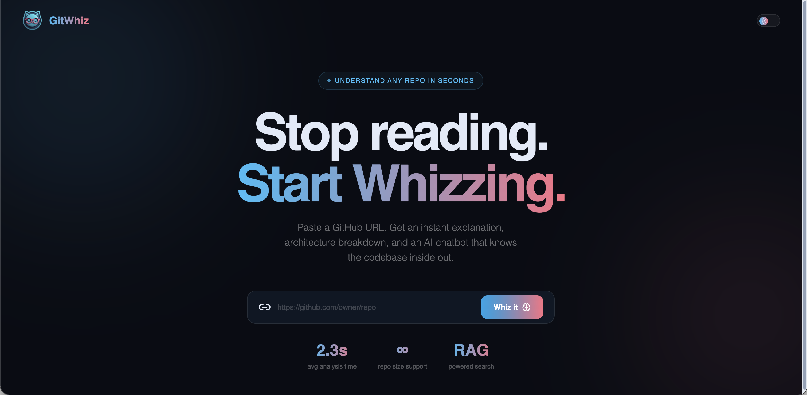
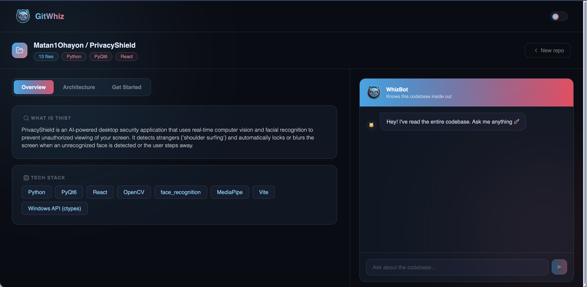
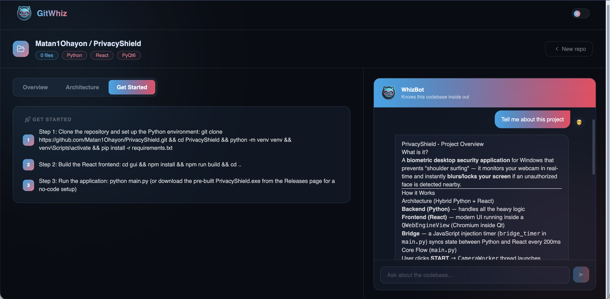

# 🧠 GitWhiz - AI Codebase Q&A

A web app that lets you paste any **GitHub repository URL**, ingest its code, and **chat with an AI** that knows the full codebase. Built with a **Hybrid Architecture** (Python FastAPI + React). Uses **RAG** (Retrieval-Augmented Generation) with semantic search so answers are grounded in the actual files—no guessing.

---

## ✨ Features

- **🔗 One-URL Ingest** – Paste a GitHub repo link; the app fetches code, chunks it, and indexes it in ChromaDB
- **📋 AI-Generated Overview** – Get an instant summary: what the project does, tech stack, architecture, and getting-started steps
- **💬 RAG-Powered Chat** – Ask questions in natural language; answers are based on retrieved code chunks and streamed in real time
- **🌐 Bilingual** – Answers follow the language of your question (English or Hebrew)
- **📂 Source Citations** – Each answer shows which files were used so you can jump into the code
- **💾 Persistent Index** – Indexed repos survive server restarts (ChromaDB on disk)
- **⚡ Rate Limits** – 5 repo ingestions per day, 50 chat messages per day (configurable via SlowAPI)
- **🎨 Modern UI** – Responsive dashboard with Overview / Architecture / Get Started tabs, dark mode, and streaming markdown

---

## 🛠️ Tech Stack

### 🧠 Backend (Python)

- **FastAPI & Uvicorn** – High-performance API framework and server
- **ChromaDB** – Vector database for RAG & embeddings
- **Cohere** – Semantic embeddings (embed-english-light-v3)
- **Anthropic Claude** – Large Language Model (claude-sonnet-4-6)
- **httpx** – Async HTTP client for GitHub API (with optional token)
- **SlowAPI** – Configurable rate limiting

### 🎨 Frontend (React)

- **React 19 & Vite** – Next-generation frontend framework and tooling
- **Tailwind CSS & Framer Motion** – Modern styling and fluid animations
- **React Router** – Client-side routing
- **react-markdown** – Rendering markdown responses
- **Lucide React** – Beautiful and consistent iconography

---

## 📸 Screenshots

<p align="center">
  
  
  
</p>

---

## ⚙️ Installation & Development

### Prerequisites

- **Python 3.10 or higher**
- **Node.js** (for the frontend)
- **Anthropic API Key**
- **Cohere API Key**
- **GitHub Personal Access Token** (Optional but recommended)

### Setup

**Clone the repository:**

```bash
git clone https://github.com/Matan1Ohayon/GitWhiz.git
cd GitWhiz
```

**Setup Backend (Python):**

```bash
cd backend
python -m venv venv
source venv/bin/activate   # On Windows: venv\Scripts\activate
pip install -r requirements.txt
```

**Configure Environment Variables:**

Create a `.env` file in the `backend` directory (see `backend/.env.example`):

```env
ANTHROPIC_API_KEY=your_anthropic_api_key_here
GITHUB_TOKEN=your_github_token_here
COHERE_API_KEY=your_cohere_api_key_here
```

**Run the API:**

```bash
uvicorn main:app --reload --host 0.0.0.0 --port 8000
```

**Setup and Run Frontend:**

In a new terminal:

```bash
cd frontend
npm install
```

Create a `.env` file in the frontend directory:

```env
VITE_API_URL=http://127.0.0.1:8000
```

Start the dev server:

```bash
npm run dev
```

Open the URL shown (e.g. `http://localhost:5173`), paste a GitHub repo URL, and start chatting.

---

## 🚀 Architecture Explained

This project demonstrates a powerful **Hybrid Architecture** combining a robust Python backend with a dynamic React frontend:

- **The Backend (FastAPI):** Handles the ingestion pipeline—validating GitHub URLs, fetching file trees, chunking text, and generating embeddings via Cohere. It stores everything in ChromaDB. For chat, it runs similarity searches and streams Claude's responses directly to the client.

- **The Frontend (React):** Provides a seamless user experience. It captures GitHub URLs, displays an AI-generated project overview (with tabs for Architecture and Getting Started), and features a chat panel that handles server-sent events (SSE) for real-time typing and source citations.

- **The RAG Flow:** Code is split into logical chunks and embedded. When a user asks a question, it is converted into a search query. The most relevant chunks are retrieved from ChromaDB and fed into Claude as context, ensuring answers are strictly grounded in the real codebase.

---

## 📂 App Structure

```
GitWhiz/
├── backend/              # Python FastAPI Server
│   ├── main.py           # App entry point, CORS, and routers
│   ├── requirements.txt  # Python dependencies
│   ├── .env.example      # API keys template
│   ├── routers/          # API endpoints (ingest.py, chat.py)
│   ├── services/         # Core logic (github_service.py, rag_service.py)
│   └── chroma_data/      # Persisted Vector DB (created at runtime)
├── frontend/             # React UI
│   ├── src/              # React source code (components, pages, services)
│   ├── package.json      # Node dependencies
│   └── .env.example      # Frontend config
└── README.md             # Documentation
```

---

## 🎯 Key Capabilities

**Semantic Code Search**  
Using Cohere embeddings and ChromaDB, the system maps user questions to the most relevant code chunks. This allows the AI to answer complex architectural questions based on actual code rather than hallucinated assumptions.

**Real-Time Streaming Chat**  
The application utilizes Server-Sent Events (SSE) to stream the LLM's response directly to the UI as it's being generated. It seamlessly appends source file citations once the streaming is complete.

**Smart Caching & Ingestion**  
The ingest endpoint automatically detects if a repository has already been indexed. Instead of re-fetching from GitHub and wasting API calls, it instantly returns the cached RAG overview.

---

## 📝 License

This project is private.

All Rights Reserved | Matan Ohayon © 2026

---

## 📬 Contact

- 🌐 Portfolio: https://matans-portfolio.vercel.app/
- 💼 LinkedIn: [Matan Ohayon](https://www.linkedin.com/in/matan-ohayon-4101b6276/)
- 📧 Email: matan1ohayon@gmail.com
